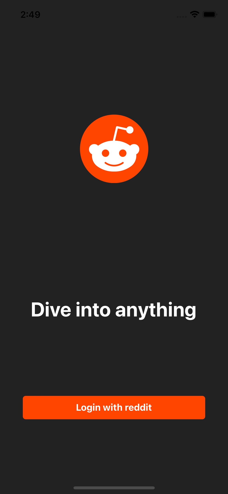
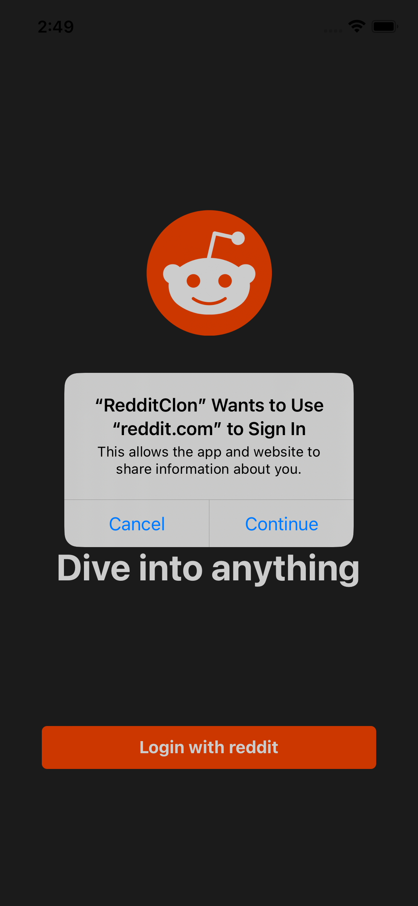
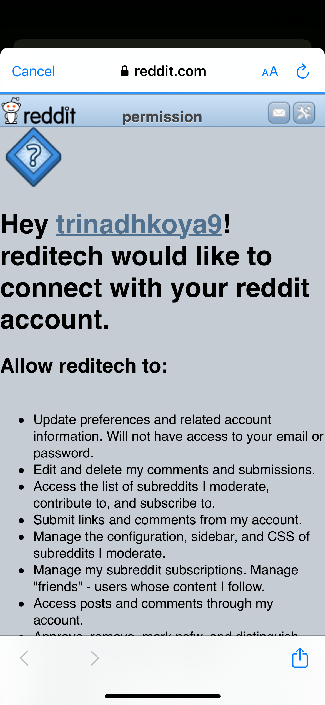

RedditClone

TODO:

Redux-Saga
Focus Mode should play the video
# RN-RedditClient

## Simple Reddit client written in RN.

### Try and Play
- `git clone https://github.com/trinadhkoya/react-native-reddit-clone`
- `cd  RN-RedditClient`
- `npm install`
- For ios only `cd ios && pod install && cd .. && react-native run-ios`

# Screenshots
<table>
  <tr>
    <td></td>
    <td></td>
    <td></td>
  <tr>

</table>
