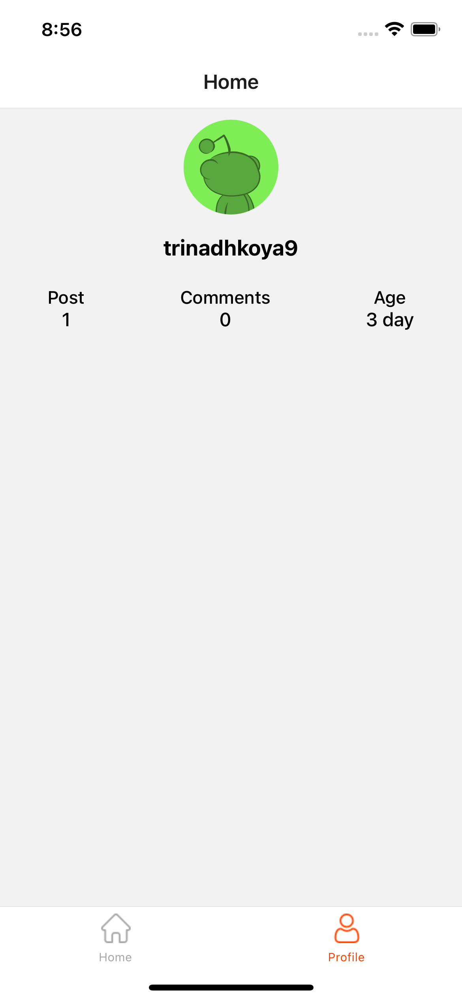

# react-native-reddit-clone
Reddit Clone written in Bare React Native.
## Get started
* clone https://github.com/trinadhkoya/react-native-reddit-clone
* go to root folder of project and run the command `yarn install`
* if you are on Mac M1, run `yarn pod` which will help you to install pods on your iOS
* finally run `yarn ios` to see the demo in action

### Covered and WIP:
1. Filter Posts‍✅
2. Redux-Saga ✅
3. Redux✅ 
4. Focus Mode should play the video✅ 
5. API Client Re-Usable✅

#### Screenshots

<table>
  <tr>
  
  <tr>
  <tr>
    <td></td>
    <td></td>
    <td></td>
  <tr>
  <tr>
    <td></td>
    <td></td>
    <td></td>
  <tr>

</table>

##### NOTE
I have not tested this on android for time being. Please let me know if in case if you find any issues

I am working on a fix, where user is not navigated to home after successful login attempt in the [saga](https://github.com/trinadhkoya/react-native-reddit-clone/tree/feature/with-saga
) branch 

For saga related work please check out [this](https://github.com/trinadhkoya/react-native-reddit-clone/tree/feature/with-saga
) branch. 

###### Author:
trinadhkoya

Portfolio: <a href='https://trinadhkoya.dev'>trinadhkoya.dev</a>
<td>

</td>
